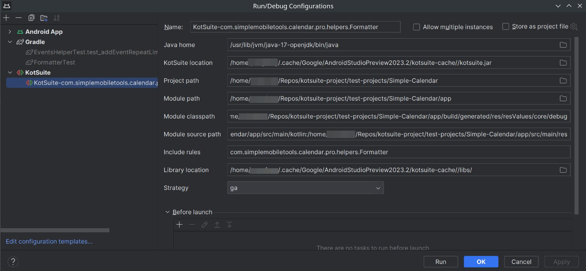
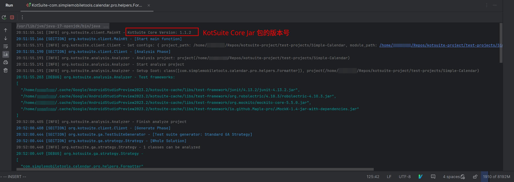

# kotsuite-opendata

KotSuite is an automated tool of unit test generation of Kotlin programs in Android projects. This site provides a prototype of the tool, along with a user guide and some experimental data.

## 1. KotSuite Tool

### 1.1 Demo Video

<video width="100%" controls>
    <source src="https://github.com/user-attachments/assets/333fadf1-4363-4656-9be6-4f362791f91d" type="video/mp4">
</video>

https://github.com/user-attachments/assets/333fadf1-4363-4656-9be6-4f362791f91d

### 1.2 Toolkit

The binary version of the tool is provided in the [`kotsuite-toolkit`](./kotsuite-toolkit/) directory.

## 2. User Guide

### 2.1 File Structure of the toolkit

```
kotsuite-toolkit
├── kotsuite-1.2.1.zip              # KotSuite Android Studio plugin (no need to unzip)
├── kotsuite-core-fat-1.2.1.jar     # KotSuite Core jar package
└── libs                            # KotSuite Core dependencies lib folder
```

### 2.2 Installation Guide

#### 2.2.1 Installing the KotSuite Plugin

##### Method 1: Online Installation

Search for "KotSuite" in the Android Studio plugin marketplace, as shown below:


##### Method 2: Install from Disk

Click "Install Plugin from Disk" and select "kotsuite-1.2.1.zip" from the "kotsuite-toolkit" folder to complete the installation.


#### 2.2.2 Configuring KotSuite

1.   Open Settings and go to the KotSuite configuration page, as shown below:


2.   Configure the KotSuite options as follows:

     -   Java Home (optional): Path to Java Home. If left empty, it defaults to the system's Java Home environment variable.
     -   KotSuite Location (required): Path to the KotSuite Core jar package. Choose "kotsuite-core-fat-1.2.1.jar" from the "Toolkit" folder.
     -   Library Location (required): Path to KotSuite dependencies lib. Select the "libs" folder from the "Toolkit" folder.
     -   Generation Strategy (required): Strategy for test generation; select `ga`.

> Note: These options only need to be configured once. After configuration, the plugin will cache the KotSuite Core jar and lib folder in Android Studio's cache directory.

### 2.3 Usage Guide

> Note: Build the project before running.

1.   In Android Studio's file list, right-click on the class or package to be tested and select "Run KotSuite."
2.   A confirmation dialog will appear with parameters for the algorithm run. Users can modify these parameters as needed, as shown below:
     -   Selected Module Path: Path to the module containing the class or package to be tested.
     -   Module Class Path: Path to the compiled class files for the tested module.
     -   Module Source Path: Path to the source files for the tested module.
     -   Include Rules: Specifies which classes to generate test cases for (prefix match). Use `&` to separate multiple rules.
         -   For example, `com.simplemobiletools.calendar.pro.helpers.Formatter&com.simplemobiletools.calendar.pro.fragments.WeekFragmentsHolder` will target two classes.


3.   After clicking OK, a Run Configuration for this algorithm run will be generated and automatically executed. You can view the Run Configuration as follows:


The Run Configuration allows users to edit parameters, stop, or rerun. The parameters have the same meanings as above.

> Note: Generated Run Configurations are prefixed with "KotSuite-."



4.   Logs will be output during the algorithm's execution, as shown below:



Users can stop the algorithm at any time.

5.   Successful Completion: The algorithm completes with a `Success!` log entry, such as:

```
04:34:53.801 [SUCCESS] org.kotsuite.client.Client - Success!
```

### 2.4 Output Results

#### 2.4.1 Output Structure

```
kotsuite                                          # Root directory for algorithm output
├── 20231114_193702                               # Directory for the current run (timestamp)
│   ├── final                                     # Final output results
│   │   ├── assert           
│   │   ├── classes
│   │   ├── command
│   │   ├── decompiled                            # Generated Java test case files
│   │   │   ├── success                           # Test cases that run successfully
│   │   │   └── failed                            # Test cases needing manual revision
│   │   ├── exec
│   │   ├── report                                # Generated test report
│   │   │   ├── coverage_report_20231114_193702   # HTML format test coverage report
│   │   │   ├── coverage_xml_20231114_193702.xml  # XML format test coverage report
│   │   │   ├── overall_statistic.json            # General statistics
│   │   │   ├── report_20231114_193702.json       # Test report
│   │   │   └── statistic_20231114_193702.json    # Test data statistics
│   │   └── test
│   ├── sootOutput                                # Intermediate files for the algorithm
│   │   ├── com
│   │   ├── KotMain.class
│   │   └── META-INF
│   ├── kotsuite.log                              # Log file for the current run
│   ├── kotsuite-arguments.txt
│   ├── kotsuite-dependency-classpath.txt
│   └── kotsuite-module-information.txt
│
├── 20231114_201607
│   ├── ...
```

`$MODULE_ROOT/kotsuite.log` contains the log file for the algorithm run.

> Note: You may add `kotsuite/` to `.gitignore`.

#### 2.4.2 Using Generated Test Cases

Copy Java test case files from `final/decompiled/` into the project’s test module:

-   Test cases in the `success` folder can be used directly.
-   Test cases in the `failed` folder require modification.

> Note: Add the following dependencies to `build.gradle.kts` in your project:
>
> ```kotlin
> testImplementation("junit:junit:4.13.2")
> testImplementation("io.github.Maple-pro:JMockK:1.4")
> ```

## 3. Experiment Data

The experimental data is in [`experiments-data`](./experiments-data/) directory.

### 3.1 Experiment Data Description

```
experiments-data
├── apk                                 # APK files of certain experimental subjects
├── evosuite                            # Experimental Result of EvoSuite in Android Projects
├── loc.sh                              # Script for counting project code lines
├── open-source                         # Experimental Result of KotSuite in open-source projects
├── oppo-data                           # Experimental Result of KotSuite in Oppo Data
├── org.jacoco.cli-0.8.10-nodeps.jar    # Command-line tool for parsing JaCoCo results
├── origin-data                         # Original experimantal result of KotSuite in open-source
├── project_analyzer.py                 # Script for analyzing project information
└── repos                               # Repositories of experimental subjects
```

### 3.2 Experiment Result in OPPO Projects

We conducted experiments on an internal project at Oppo. Due to confidentiality requirements, only a portion of the test case coverage report is presented below.

#### A. Coverage Report of `SystemUi`


#### B. Coverage Report of `OppoGallery3D`


### 3.1 Example Generated Test Cases


